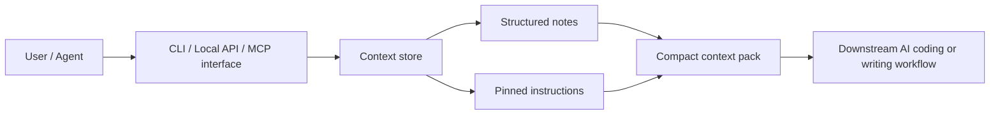

# Context-Sidecar


Context-Sidecar v1 is a local-first agent context sidecar. It stores small structured context items and returns a compact context pack that an agent can consume through the CLI, a local HTTP API, or MCP.

It exists to reduce repetition. Instead of re-explaining stable preferences, pinned instructions, project facts, workflow notes, and current task notes every session, you can save them once and ask Context-Sidecar for the best context pack for a namespace and task.

## What It Stores

- user preferences
- profile facts
- project facts
- current task notes
- pinned instructions
- workflow notes

Every item belongs to a namespace such as `default`, `personal`, or `project:repo-a`.

Items support a simple lifecycle:

- `active`
- `pinned`
- `archived`
- `expired`

## How Context Packs Work

Given a namespace and optional task query, Context-Sidecar:

1. loads items from that namespace
2. excludes archived items by default
3. excludes expired items
4. ranks pinned items first
5. then ranks by priority, simple text relevance, and recency
6. returns a compact structured pack plus agent-ready `rendered_text`

Rendered text uses a stable format:

```text
[Context Pack]
Namespace: <namespace>
Generated At: <timestamp>

[Pinned Instructions]
- ...

[Preferences]
- ...

[Project Facts]
- ...

[Current Task Notes]
- ...

[Workflow Notes]
- ...
```

Empty sections are omitted.

## Conceptual architecture

The diagram below is a conceptual architecture based on the current repo structure.



## Quick Start

```bash
./pnpm install
./pnpm typecheck
./pnpm test
```

## CLI

All context commands support `--json`.

```bash
./pnpm exec context-sidecar context add \
  --namespace project:repo-a \
  --item-type pinned_instruction \
  --content "Keep scope tight." \
  --source-type manual_entry \
  --status pinned \
  --json

./pnpm exec context-sidecar context list --namespace project:repo-a --json
./pnpm exec context-sidecar context search --namespace project:repo-a --query "scope" --json
./pnpm exec context-sidecar context pack --namespace project:repo-a --task-query "scope" --json
./pnpm exec context-sidecar context get --id <context-id> --json
./pnpm exec context-sidecar context update --id <context-id> --priority 50 --json
./pnpm exec context-sidecar context archive --id <context-id> --json
./pnpm exec context-sidecar context pin --id <context-id> --json
```

## HTTP API

Start the local API:

```bash
./pnpm exec context-sidecar serve api
```

Endpoints:

- `POST /context`
- `PATCH /context/:id`
- `GET /context/:id`
- `GET /context`
- `POST /context/search`
- `POST /context/pack`
- `POST /context/:id/archive`
- `POST /context/:id/pin`
- `GET /health`
- `GET /capabilities`

## MCP

Start the MCP server:

```bash
./pnpm exec context-sidecar serve mcp
```

Available v1 tools:

- `context_add`
- `context_update`
- `context_get`
- `context_list`
- `context_search`
- `context_pack`
- `context_archive`
- `context_pin`
- `health_check`

## Validation

```bash
./pnpm typecheck
./pnpm test
./pnpm eval
```

## What V1 Does Not Do

- semantic truth resolution
- contradiction intelligence for context items
- vector memory magic
- multi-user sync
- web-first UX
- cloud auth
- background jobs

It is intentionally small, local, inspectable, and deterministic.
