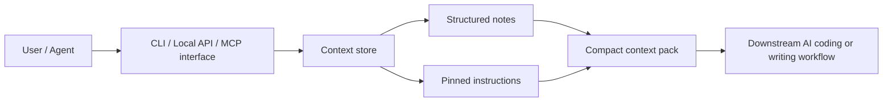

# Context-Sidecar


Context-Sidecar v1 is a local-first agent context sidecar. It stores small structured context items and returns a compact context pack that an agent can consume through the CLI, a local HTTP API, or MCP.

It exists to reduce repetition. Instead of re-explaining stable preferences, pinned instructions, project facts, workflow notes, and current task notes every session, you can save them once and ask Context-Sidecar for the best context pack for a namespace and task.

If you are wiring the repo into an AI agent, start with [`docs/ai-agents.md`](./docs/ai-agents.md) and the root [`SKILL.md`](./SKILL.md).

## What It Stores

- user preferences
- profile facts
- project facts
- current task notes
- pinned instructions
- workflow notes

Every item belongs to a namespace such as `default`, `personal`, or `project:repo-a`.

Items support a simple lifecycle:

- `active`
- `pinned`
- `archived`
- `expired`

## How Context Packs Work

Given a namespace and optional task query, Context-Sidecar:

1. loads items from that namespace
2. excludes archived items by default
3. excludes expired items
4. ranks pinned items first
5. then ranks by priority, simple text relevance, and recency
6. returns a compact structured pack plus agent-ready `rendered_text`

Rendered text uses a stable format:

```text
[Context Pack]
Namespace: <namespace>
Generated At: <timestamp>

[Pinned Instructions]
- ...

[Preferences]
- ...

[Project Facts]
- ...

[Current Task Notes]
- ...

[Workflow Notes]
- ...
```

Empty sections are omitted.

## Conceptual architecture

The diagram below is a conceptual architecture based on the current repo structure.



## Quick Start

See the full value loop in under 30 seconds:

```bash
# 1. Install dependencies
./pnpm install

# 2. Initialize a workspace
./pnpm exec context-sidecar init --json
# → { "ok": true, "rootPath": ".../.context-sidecar" }

# 3. Bootstrap the repo docs into the sidecar
./pnpm exec context-sidecar context bootstrap repo --json

# 4. Add a personal preference
./pnpm exec context-sidecar context add \
  --namespace project:context-sidecar \
  --item-type preference \
  --content "Prefer terse updates and practical implementation details." \
  --source-type manual_entry \
  --json

# 5. Pack it up — see the rendered context an agent will consume
./pnpm exec context-sidecar context pack \
  --namespace project:context-sidecar \
  --task-query "what should I know before working here?"

# Just three commands and you have a working context sidecar.
```

The `pack` output above shows the rendered text your agent will see. Add a `--json` flag to get the full structured object (each item's ID, type, priority, and `reason_included`).

## CLI

All context commands support `--json` for machine-readable output and plain text for human reading. Below are real examples of every command.

### `context add`

```bash
./pnpm exec context-sidecar context add \
  --namespace project:repo-a \
  --item-type pinned_instruction \
  --content "Keep scope tight and prefer inspectable local behavior." \
  --source-type manual_entry \
  --status pinned \
  --json
```

```json
{
  "id": "ctx_a4058224f392cfe8",
  "namespace": "project:repo-a",
  "item_type": "pinned_instruction",
  "content": "Keep scope tight and prefer inspectable local behavior.",
  "source_type": "manual_entry",
  "source_reference": null,
  "priority": 0,
  "status": "pinned",
  "created_at": "2026-06-11T20:19:55.856Z",
  "updated_at": "2026-06-11T20:19:55.856Z",
  "expires_at": null,
  "tags": [],
  "metadata": {}
}
```

### `context list`

```bash
./pnpm exec context-sidecar context list --namespace project:repo-a --json
```

```json
[
  {
    "id": "ctx_a4058224f392cfe8",
    "namespace": "project:repo-a",
    "item_type": "pinned_instruction",
    "content": "Keep scope tight and prefer inspectable local behavior.",
    "source_type": "manual_entry",
    "source_reference": null,
    "priority": 0,
    "status": "pinned",
    "created_at": "2026-06-11T20:19:55.856Z",
    "updated_at": "2026-06-11T20:19:55.856Z",
    "expires_at": null,
    "tags": [],
    "metadata": {}
  }
]
```

### `context namespaces`

```bash
./pnpm exec context-sidecar context namespaces --json
```

```json
[
  {
    "namespace": "project:repo-a",
    "item_count": 1,
    "active_count": 0,
    "pinned_count": 1,
    "archived_count": 0,
    "expired_count": 0,
    "latest_updated_at": "2026-06-11T20:19:55.856Z"
  }
]
```

### `context search`

```bash
./pnpm exec context-sidecar context search --namespace project:repo-a --query "scope" --json
```

```json
[
  {
    "id": "ctx_a4058224f392cfe8",
    "namespace": "project:repo-a",
    "item_type": "pinned_instruction",
    "content": "Keep scope tight and prefer inspectable local behavior.",
    "source_type": "manual_entry",
    "source_reference": null,
    "priority": 0,
    "status": "pinned",
    "created_at": "2026-06-11T20:19:55.856Z",
    "updated_at": "2026-06-11T20:19:55.856Z",
    "expires_at": null,
    "tags": [],
    "metadata": {}
  }
]
```

### `context pack` (⭐ the biggest sell)

```bash
./pnpm exec context-sidecar context pack \
  --namespace project:demo \
  --task-query "what should I know before working here?" \
  --json
```

```json
{
  "namespace": "project:demo",
  "generated_at": "2026-06-11T20:19:43.967Z",
  "task_query": "what should I know before working here?",
  "items": [
    {
      "id": "ctx_dcfebce969130813",
      "item_type": "pinned_instruction",
      "content": "Keep scope tight and prefer inspectable local behavior.",
      "priority": 100,
      "status": "pinned",
      "source_type": "manual_entry",
      "source_reference": null,
      "reason_included": "Pinned items always win and are included first."
    },
    {
      "id": "ctx_43b4345741cd212a",
      "item_type": "project_fact",
      "content": "CLI, HTTP, and MCP all share the same storage-backed service.",
      "priority": 80,
      "status": "active",
      "source_type": "system_note",
      "source_reference": null,
      "reason_included": "Matches task query: what should I know before working here?"
    },
    {
      "id": "ctx_6520b9d7a60253b5",
      "item_type": "preference",
      "content": "Prefer terse updates and practical implementation details.",
      "priority": 70,
      "status": "active",
      "source_type": "user_message",
      "source_reference": null,
      "reason_included": "Matches task query: what should I know before working here?"
    },
    {
      "id": "ctx_b7dbcaf19182924d",
      "item_type": "task_note",
      "content": "Run pnpm eval and pnpm test before claiming the repo is ready.",
      "priority": 60,
      "status": "active",
      "source_type": "manual_entry",
      "source_reference": null,
      "reason_included": "Matches task query: what should I know before working here?"
    }
  ],
  "rendered_text": "[Context Pack]\nNamespace: project:demo\nGenerated At: 2026-06-11T20:19:43.967Z\nTask Query: what should I know before working here?\n\n[Pinned Instructions]\n- Keep scope tight and prefer inspectable local behavior.\n\n[Preferences]\n- Prefer terse updates and practical implementation details.\n\n[Project Facts]\n- CLI, HTTP, and MCP all share the same storage-backed service.\n\n[Current Task Notes]\n- Run pnpm eval and pnpm test before claiming the repo is ready."
}
```

Without `--json`, the same command prints the `rendered_text` directly — the exact context an agent will see:

```text
[Context Pack]
Namespace: project:demo
Generated At: 2026-06-11T20:19:39.423Z
Task Query: what should I know before working here?

[Pinned Instructions]
- Keep scope tight and prefer inspectable local behavior.

[Preferences]
- Prefer terse updates and practical implementation details.

[Project Facts]
- CLI, HTTP, and MCP all share the same storage-backed service.

[Current Task Notes]
- Run pnpm eval and pnpm test before claiming the repo is ready.
```

### `context get`

```bash
./pnpm exec context-sidecar context get --id ctx_a4058224f392cfe8 --json
```

```json
{
  "id": "ctx_a4058224f392cfe8",
  "namespace": "project:repo-a",
  "item_type": "pinned_instruction",
  "content": "Keep scope tight and prefer inspectable local behavior.",
  "source_type": "manual_entry",
  "source_reference": null,
  "priority": 0,
  "status": "pinned",
  "created_at": "2026-06-11T20:19:55.856Z",
  "updated_at": "2026-06-11T20:19:55.856Z",
  "expires_at": null,
  "tags": [],
  "metadata": {}
}
```

### `context update`

```bash
./pnpm exec context-sidecar context update --id ctx_a4058224f392cfe8 --priority 50 --json
```

```json
{
  "id": "ctx_a4058224f392cfe8",
  "namespace": "project:repo-a",
  "item_type": "pinned_instruction",
  "content": "Keep scope tight and prefer inspectable local behavior.",
  "source_type": "manual_entry",
  "source_reference": null,
  "priority": 50,
  "status": "pinned",
  "created_at": "2026-06-11T20:19:55.856Z",
  "updated_at": "2026-06-11T20:20:21.744Z",
  "expires_at": null,
  "tags": [],
  "metadata": {}
}
```

### `context archive`

```bash
./pnpm exec context-sidecar context archive --id ctx_a4058224f392cfe8 --json
```

```json
{
  "id": "ctx_a4058224f392cfe8",
  "namespace": "project:repo-a",
  "item_type": "pinned_instruction",
  "content": "Keep scope tight and prefer inspectable local behavior.",
  "source_type": "manual_entry",
  "source_reference": null,
  "priority": 50,
  "status": "archived",
  "created_at": "2026-06-11T20:19:55.856Z",
  "updated_at": "2026-06-11T20:20:23.658Z",
  "expires_at": null,
  "tags": [],
  "metadata": {}
}
```

### `context pin`

```bash
./pnpm exec context-sidecar context pin --id ctx_a4058224f392cfe8 --json
```

```json
{
  "id": "ctx_a4058224f392cfe8",
  "namespace": "project:repo-a",
  "item_type": "pinned_instruction",
  "content": "Keep scope tight and prefer inspectable local behavior.",
  "source_type": "manual_entry",
  "source_reference": null,
  "priority": 50,
  "status": "pinned",
  "created_at": "2026-06-11T20:19:55.856Z",
  "updated_at": "2026-06-11T20:20:25.401Z",
  "expires_at": null,
  "tags": [],
  "metadata": {}
}
```

### `context summary`

```bash
./pnpm exec context-sidecar context summary --json
```

```json
{
  "ok": true,
  "rootPath": "/Users/.../.context-sidecar",
  "storageExists": true,
  "namespaces": [
    {
      "namespace": "project:demo",
      "item_count": 4,
      "active_count": 3,
      "pinned_count": 1,
      "archived_count": 0,
      "expired_count": 0,
      "latest_updated_at": "2026-06-11T20:19:55.856Z"
    }
  ],
  "totals": {
    "namespaceCount": 1,
    "itemCount": 4,
    "activeCount": 3,
    "pinnedCount": 1,
    "archivedCount": 0,
    "expiredCount": 0
  },
  "recommendedNextStep": "Run `pnpm exec context-sidecar context pack --namespace <namespace>` for the namespace you are working in."
}
```

### `context import markdown`

```bash
./pnpm exec context-sidecar context import markdown \
  --namespace project:repo-a \
  --input . \
  --item-type project_fact \
  --json
```

### `context bootstrap repo`

```bash
./pnpm exec context-sidecar context bootstrap repo \
  --namespace project:my-project \
  --priority 80 \
  --json
```

Imports `README.md`, `ROADMAP.md`, and `docs/` into the sidecar as project facts.

### `doctor`

Check environment and workspace readiness:

```bash
./pnpm exec context-sidecar doctor --json
```

```json
{
  "ok": true,
  "rootPath": "/Users/.../.context-sidecar",
  "node": "v24.11.1",
  "manifest": {
    "schemaVersion": 1,
    "id": "capabilities",
    "name": "synthkit",
    "version": "0.1.0",
    "transports": ["stdio", "http-json", "cli"],
    "ingestKinds": ["text", "markdown", "pdf", "url", "transcript", "image"],
    "synthesisModes": ["brief", "decision_memo", "deck_outline"],
    "providerCapabilities": ["text-generation", "embeddings", "ocr", "transcription"],
    "features": ["project-lifecycle", "citation-mapping", "contradiction-detection", "revision-history", "mock-provider"],
    "limits": { "maxSourcesPerProject": 250, "maxChunkChars": 1600, "defaultChunkChars": 900 },
    "createdAt": "2026-06-11T20:19:53.940Z",
    "metadata": { "storage": "sqlite" }
  },
  "storageExists": true
}
```

**Note**: The `withService` helper function has been added to reduce code duplication in CLI commands, improving maintainability while keeping all functionality intact.

## HTTP API

Start the local API:

```bash
./pnpm exec context-sidecar serve api
```

Endpoints:

- `POST /context`
- `PATCH /context/:id`
- `GET /context/:id`
- `GET /context`
- `POST /context/search`
- `POST /context/pack`
- `POST /context/:id/archive`
- `POST /context/:id/pin`
- `GET /health`
- `GET /capabilities`

## MCP

Start the MCP server:

```bash
./pnpm exec context-sidecar serve mcp
```

Available v1 tools:

- `context_add`
- `context_update`
- `context_get`
- `context_list`
- `context_search`
- `context_pack`
- `context_archive`
- `context_pin`
- `health_check`

## Validation

```bash
./pnpm typecheck
./pnpm test
./pnpm eval
./pnpm demo
```

## What V1 Does Not Do

- semantic truth resolution
- contradiction intelligence for context items
- vector memory magic
- multi-user sync
- web-first UX
- cloud auth
- background jobs

It is intentionally small, local, inspectable, and deterministic.
